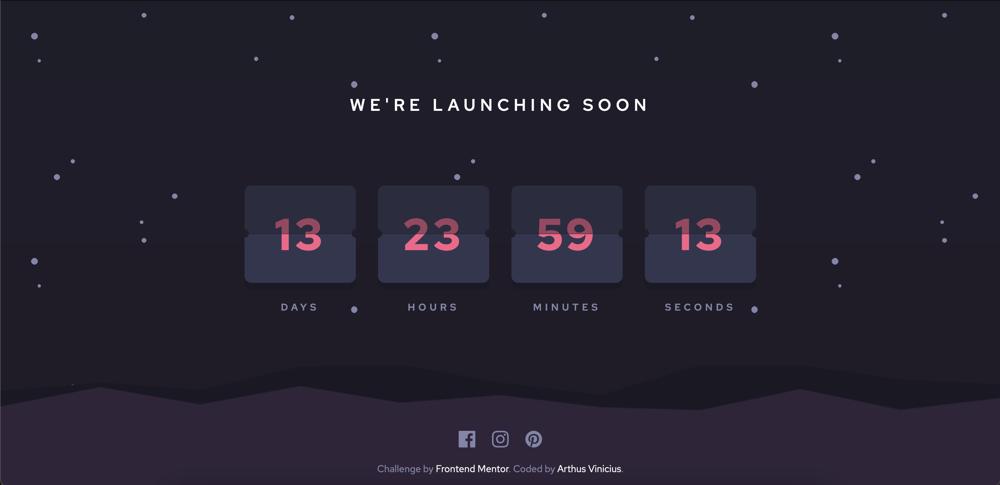

# Frontend Mentor - Launch countdown timer solution

This is a solution to the [Launch countdown timer challenge on Frontend Mentor](https://www.frontendmentor.io/challenges/launch-countdown-timer-N0XkGfyz-). Frontend Mentor challenges help you improve your coding skills by building realistic projects. 

## Table of contents

- [Frontend Mentor - Launch countdown timer solution](#frontend-mentor---launch-countdown-timer-solution)
  - [Table of contents](#table-of-contents)
  - [Overview](#overview)
    - [The challenge](#the-challenge)
    - [Screenshot](#screenshot)
    - [Links](#links)
  - [My process](#my-process)
    - [Built with](#built-with)
    - [Continued development](#continued-development)
    - [Useful resources](#useful-resources)
  - [Author](#author)

**Note: Delete this note and update the table of contents based on what sections you keep.**

## Overview

### The challenge

Users should be able to:

- See hover states for all interactive elements on the page
- See a live countdown timer that ticks down every second (start the count at 14 days)
- **Bonus**: When a number changes, make the card flip from the middle

### Screenshot

### Links

- Solution URL: [Github](https://github.com/arthus05/fm-launch-countdown-timer)
- Live Site URL: [Github Pages](https://arthus05.github.io/fm-launch-countdown-timer/)

## My process
Since it is a simple project, I initially thought of doing it with *HTML*, *CSS* and *Vanilla JS*. But I recently failed a *React* job tech interview that has a similar challenge, It was also to develop a countdown. Hence, to train my *React* skills, learn what I did wrong and such, I decided to develop this challenge with *React*. (I'm using the minimal way that I could think of React, since I was only interested on the states and hooks logic for this single component, so CRA and such seams a bit overdue).

1) I started with the HTML structure, then I added React and Babel(to be able to use JSX) links on the HTML header.

2) Then I created the app logic, in the script using React Hooks

3) Lastly, I added all the styling. I used the [haikei](https://app.haikei.app/) app to generate the svg drawings of the page.

### Built with

- HTML and CSS
- [React](https://reactjs.org/) - JS library
- [Babel](https://babeljs.io/) - JS compiler
- [Haikei](https://app.haikei.app/) - SVG Generator

### Continued development

I this project I saw that I have to improve and study more about svg, how they work and how to interact more with them. Also I have dificulties on making the site responsive, so I have to study and practive more responsiveness.

### Useful resources

- [Haikei](https://app.haikei.app/) - This helped me to create the SVGs of the site.

## Author

- Frontend Mentor - [@arthus05](https://www.frontendmentor.io/profile/arthus05)
- Twitter - [@arthus_dev](https://twitter.com/arthus_dev)

**Note: Delete this note and add/remove/edit lines above based on what links you'd like to share.**
